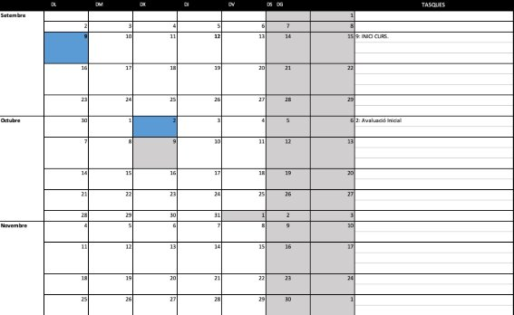
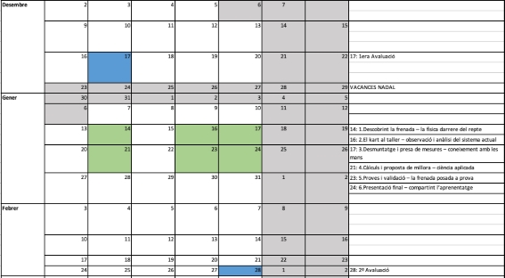
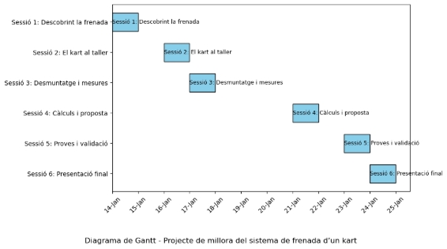

Millorant el sistema de frenada mitjançant un projecte 

Joel Marí Cervera 

Índex 

1. **Mòdul: 0455 – Sistemes de transmissió i frenada ........................................................ 3**
1. **Objectius generals específics del mòdul ........................................................................ 3**
1. **Continguts ........................................................................................................................ 4**
1. **Relació entre RA i criteris d’avaluació ......................................................................... 6**
1. **Contextualització............................................................................................................. 8**
1. **Ubicació i entorn socioeconòmic i cultural ................................................................... 9**
1. **Oferta d’ensenyaments ................................................................................................. 10**
1. **Descripció del centre: instal·lacions i recursos .......................................................... 11**
1. **Competències professionals, personals i socials del mòdul ....................................... 11**
1. **Unitats de competencia acreditades ........................................................................ 12**
1. **Justificació pedagógica ............................................................................................. 12**
1. **Continguts bàsics ...................................................................................................... 13**
1. **Introducció ................................................................................................................ 14**
1. **Objectius .................................................................................................................... 14**
1. **Metodologia ............................................................................................................... 15**
1. **Temporalització ........................................................................................................ 16**
1. **Calendari ................................................................................................................... 18**
1. **Diagrama de Gantt ................................................................................................... 19**
1. **Avaluació ................................................................................................................... 19**
1. **Taula dels RA amb els criteris d’avaluació ............................................................ 20**
1. **Instruments d’avaluació .......................................................................................... 21**
1. **Ponderació de qualificació ....................................................................................... 22**
1. **Recursos necessaris .................................................................................................. 22**
1. **Recursos Adicionals.................................................................................................. 23**
1. Mòdul: 0455 – Sistemes de transmissió i frenada 

Cicle: Tècnic en Electromecànica de vehicles 

Codi: 0455 

Duració: 154h anuals, 7h setmanals, repartides en 2 sessions de 110 minuts i una de 165 minuts. 

2. Objectius generals específics del mòdul 

Els objectius generals que es treballen en aquest mòdul són: 

- a) Interpretar la informació i, en general, tot el llenguatge simbòlic associat a les operacions  de  manteniment  i  reparació  en  l’àrea  d’electromecànica  per seleccionar el procés de reparació. 

￿ 

- b) Seleccionar les màquines, útils, eines i mitjans de seguretat necessaris per efectuar els processos de manteniment en l’àrea d’electromecànica. 

￿ 

- c) Manipular  instruments  i  equips  de  mesura  i  control,  explicant-ne  el funcionament i connectant-los adequadament per localitzar avaries. 

￿ 

- e) Analitzar la informació subministrada pels equips de diagnosi, comparant-la amb les especificacions del fabricant per determinar el procés de manteniment i reparació. 

￿ 

- h) Relacionar els elements que constitueixen els trens de rodatge, frens, direcció i suspensió amb la funció que compleixen dins del conjunt, per efectuar-ne el manteniment i la reparació. 

￿ 

- i) Aplicar  les  tècniques  i  mètodes  d’operació  pertinents  en  el  desmuntatge, muntatge i substitució d’elements mecànics, pneumàtics, hidràulics i electrònic- electrònics dels sistemes del vehicle per procedir al seu manteniment i reparació. 

￿ 

- j) Analitzar el funcionament de les centraletes electròniques i la informació que subministren, efectuant la recàrrega, extracció de dades i reinici de les mateixes per obtenir la informació necessària en el manteniment. 

￿ 

- k) Realitzar mesures, comparant els resultats amb els valors dels paràmetres de referència per verificar els resultats de les intervencions. 

￿ 

- l) Analitzar  i  descriure  els  procediments  de  prevenció  de  riscos  laborals  i mediambientals, assenyalant les accions a realitzar en els casos definits per actuar d’acord amb les normes estandarditzades. 

￿ 

- p) Reconèixer i valorar contingències, determinant les causes que les provoquen i descrivint les accions correctores per resoldre les incidències associades a la seva activitat professional. 
3. Continguts 
1. Caracterització dels sistemes de transmissió 
- Física de la transmissió del moviment 
- Interpretació de documentació tècnica  
- Embragatges i convertidors: 
  - Tipus, característiques, constitució i funcionament 
  - Fricció (secs i humits)  
  - Hidràulics  
  - Electromagnètics  
- Sistemes d’accionament: 
  - Mecànic  
  - Hidràulic  
  - Automàtic  
- Canvis de velocitats: 
  - Tipus, característiques, constitució i funcionament 
- Mecanismes de transmissió de moviment: 
  - Tipus, característiques, constitució i funcionament 
- Diferencials i grups reductors: 
  - Tipus, característiques, constitució i funcionament 
  - Diferencial convencional  
  - Sistema HALDEX  
  - Autoblocants: viscós, Torsen, hidràulic i mecànic 
- Transmissió 4x4: 
  - Acoblable  
  - Integral  
  - Caixa de transferència  
  - Reductores  
- Gestió electrònica dels sistemes de transmissió del moviment
- Controls de tracció, estabilitat, etc. 
2. Caracterització dels sistemes de frens 
- Física de la frenada  
- Interpretació de documentació tècnica  
- Sistemes de frens dels vehicles: 
  - Tipus, característiques, constitució i funcionament 
- Sistemes de comandament o accionament dels frens: 
  - Mecànics  
  - Hidràulics  
  - Pneumàtics  
  - Elèctrics  
- Sistemes de seguretat activa: 
- ABS (antibloqueig de frens)  
- ASR (control de tracció)  
- ESP (control d’estabilitat)  
- EBV (distribuïdor electrònic de força de frenada) 
- BAS (ajuda a la frenada d’emergència) 
- Interrelació entre sistemes de gestió d’estabilitat, frens i transmissió 
3. Protocol de recepció del vehicle i ordre d’intervenció 
- Fitxa de taller  
- Presa de dades  
- Observacions i defectes  
- Protecció del vehicle 
4. Equips, utensilis i ferramentes 
- Organització  
- Manteniment  
- Control 
5. Diagnosi d’avaries dels sistemes de transmissió i frens 
- Equips de mesurament i control  
- Coneixement d’equips específics (frenòmetres, Pre-ITV)  
- Paràmetres de funcionament  
- Tècniques de diagnòstic guiades  
- Normes de seguretat i ús 
6. Manteniment del sistema de transmissió 
- Equips de mesurament i control  
- Tècniques de desmuntatge i muntatge  
- Processos de reparació  
- Verificació i ajust dels sistemes  
- Processos d’actualització de dades en unitats electròniques: 
  - Reprogramació  
  - Instal·lació de nous sistemes  
- Normes de seguretat laboral i protecció ambiental 
7. Manteniment del sistema de frens 
- Equips de mesurament i control  
- Tècniques de desmuntatge i muntatge  
- Processos de reparació i substitució  
- Verificació i ajust dels sistemes  
- Processos d’actualització de dades en unitats electròniques  
- Normes de seguretat laboral i protecció ambiental 
8. Evolucions tecnològiques i expectatives de futur 
- Tendències en sistemes de transmissió i frenada 
- Electrificació i automatització  
- Integració de sistemes intel·ligents i connectats 
4. Relació entre RA i criteris d’avaluació 

RA 1. Caracteritza el funcionament del sistema de transmissió 

Criteris d’avaluació:

- a) S’han identificat els elements de transmissió de forces del vehicle. 
- b) S’han relacionat les forces que intervenen en els sistemes de transmissió amb el desplaçament del vehicle. 
- c) S’han identificat els paràmetres de funcionament dels sistemes interpretant la documentació tècnica. 
- d)  S’han  descrit  les  característiques  de  funcionament  dels  embragatges, convertidors i els seus sistemes d’accionament. 
- e) S’ha relacionat la constitució de les caixes de canvi i variadors de velocitat amb les seves característiques de funcionament. 
- f) S’han descrit les característiques de funcionament dels diferencials i altres elements de transmissió. 
- g) S’han identificat les funcions dels elements de gestió electrònica i la seva relació amb l’operativitat del sistema. 
- h) S’ha mantingut una actitud d’interès per l’evolució de la tecnologia en el sector. 

RA 2. Caracteritza el funcionament del sistema de frens 

Criteris d’avaluació:

- a) S’ha relacionat el funcionament dels elements dels circuits de frens amb els sistemes d’accionament. 
- b) S’han calculat les forces que actuen sobre les rodes segons el sistema de frenada utilitzat. 
- c) S’han identificat els elements i peces del circuit de frens sobre el vehicle. 
- d)  S’han  descrit  les  característiques  dels  sistemes  de  frens  segons  la  seva constitució. 
- e) S’han identificat les característiques dels fluids utilitzats en els sistemes de frens. 
- f) S’han identificat els paràmetres de funcionament dels sistemes interpretant la documentació tècnica. 
- g) S’ha interpretat la funció dels elements de gestió electrònica i la seva relació amb l’operativitat del sistema. 
- h) S’ha valorat l’actitud, l’interès i la motivació en el sector. 

RA 3. Localitza avaries en els sistemes de transmissió i frenada 

Criteris d’avaluació:

- a) S’ha seleccionat i interpretat la documentació tècnica. 
- b) S’ha identificat l’element o sistema que presenta la disfunció. 
- c) S’ha seleccionat l’equip de mesura o control i s’ha efectuat la seva posada en servei. 
- d) S’ha efectuat la connexió de l’equip als punts de mesura correctes. 
- e) S’ha realitzat la comprovació o mesura dels paràmetres estipulats. 
- f) S’ha extret la informació de les unitats de gestió electrònica. 
- g) S’ha comprovat l’absència de sorolls anòmals, preses d’aire o pèrdues de fluids. 
- h) S’han comparat els valors obtinguts amb els estipulats, determinant l’element a substituir o reparar. 
- i) S’han determinat les causes que han provocat l’avaria. 
- j)  S’ha  planificat  de  forma  metòdica  la  realització  de  les  activitats  preveient possibles dificultats. 

RA 4. Manté els sistemes de transmissió de forces del vehicle 

Criteris d’avaluació:

- a)  S’ha  interpretat  la  documentació  tècnica  i  s’ha  relacionat  amb  el  sistema objecte del manteniment. 
- b) S’han seleccionat els equips i mitjans necessaris i s’ha realitzat la seva posada en servei. 
- c)  S’han  realitzat  les  operacions  de  desmuntatge  i  muntatge  seguint  les especificacions tècniques. 
- d)  S’ha  efectuat  la  reparació  de  components  o  elements  dels  sistemes  de transmissió de força. 
- e) S’han realitzat els controls i ajustos dels paràmetres estàtics i dinàmics segons especificacions tècniques. 
- f) S’ha verificat que es restitueix la funcionalitat requerida en el sistema. 
- g) S’ha observat una actitud ordenada i metòdica en la realització de les activitats. 
- h) S’han complert les normes de prevenció de riscos laborals. 

RA 5. Manté els sistemes de frens 

Criteris d’avaluació:

- a)  S’ha  interpretat  la  documentació  tècnica  i  s’ha  relacionat  amb  el  sistema objecte del manteniment. 
- b) S’han seleccionat els equips i mitjans necessaris i s’ha realitzat la seva posada en servei. 
- c)  S’han  realitzat  les  operacions  de  desmuntatge  i  muntatge  seguint  les especificacions tècniques. 
- d) S’ha reparat el sistema de frens assegurant l’absència de vibracions, sorolls i desplaçaments anòmals. 
- e) S’ha verificat l’estanquitat del circuit de frens i la frenada efectiva segons normes tècniques i ambientals. 
- f) S’han realitzat els controls i ajustos dels paràmetres estàtics i dinàmics segons especificacions tècniques. 
- g) S’han reparat els sistemes antibloqueig de rodes i de control de tracció. 
- h) S’ha verificat que es restitueix la funcionalitat requerida en el sistema. 
- i) S’han complert les normes de prevenció de riscos laborals. 
5. Contextualització 

La proposta es desenvolupa al Centre Integrat Públic de Formació Professional (CIPFP) de Xest, situat en una zona semiurbana de la província de València. Aquest centre és una referència en la formació professional de l’àmbit de l’automoció, i compta amb unes instal·lacions àmplies i ben equipades que permeten desenvolupar una formació tècnica de qualitat. 

El CIPFP de Xest disposa de dos tallers principals destinats al desenvolupament dels cicles formatius de grau mitjà en Electromecànica de Vehicles i Carrosseria, així com un taller específic per al cicle de grau superior en Automoció. A més, destaca per tindre un taller especialitzat  en  Electromecànica  de  competició,  on  l’alumnat  pot  treballar  amb vehicles d’altes prestacions i adquirir experiència en entorns similars als del món de la competició  professional.  El  centre  també  compta  amb  dos  edificis  plens  d’aules destinades  a  la  formació  teòrica,  equipades  amb  recursos  digitals  i  tecnològics actualitzats. 

El grup destinatari d’aquesta situació d’aprenentatge està format per 18 alumnes de 2n curs  del  cicle  formatiu  de  grau  mitjà  en  Electromecànica  de  Vehicles,  amb  una composició diversa: 15 xics i 3 xiques, 2 repetidors, 1 alumne amb dislèxia, 1 amb TDAH i 1 alumne amb altes capacitats i gran motivació per la mecànica esportiva, que sovint actua com a referent dins del grup. 

La situació d’aprenentatge es planteja com un repte tècnic real i motivador: millorar el sistema de frenada d’un kart, analitzant el seu funcionament actual, prenent mesures, realitzant càlculs i aplicant millores que siguen tècnicament justificades. Aquesta activitat es desenvolupa al taller del centre, amb karts reals i ferramentes professionals, en un entorn que simula fidelment la realitat del món laboral. 

Per garantir una participació activa i equitativa, l’alumnat es distribuirà en 6 grups de 3 persones. Aquesta configuració permet: 

- Una millor atenció individualitzada dins de cada grup. 
- Una distribució clara de rols (coordinador, tècnic de frenada, tècnic de càlcul i verificació). 
- Una major cohesió i comunicació, especialment important per a alumnes amb necessitats educatives específiques. 
- Facilita l’observació i seguiment docent del procés de treball. 

En cas que es considere necessari per motius pedagògics o d’integració, es podria formar un grup de 4 alumnes, especialment si inclou l’alumne amb TDAH o dislèxia, per tal de garantir un suport més gran i una millor dinàmica de treball. 

6. Ubicació i entorn socioeconòmic i cultural 

El Centre  Integrat  Públic  de  Formació  Professional  (CIPFP)  de  Cheste està  situat al Complex Educa u de Cheste , a la carretera CV-378, a pocs quilòmetres del nucli urbà d’aquesta localitat valenciana. Aquest entorn privilegiat, envoltat de natura i amb àmplies instal·lacions, ofereix un espai ideal per a l’aprenentatge tècnic i pràc c, allunyat del bullici urbà però ben connectat amb la ciutat de València i altres nuclis industrials de la comarca. El centre és hereu de l’an ga Universitat Laboral de Cheste, i manté una forta vocació de  servei  públic  i  de  qualitat  educa va.  Amb  una  llarga  trajectòria  en  la  formació professional, el CIPFP de Cheste s’ha consolidat com un referent autonòmic i estatal, amb una clara projecció europea. 

En l’àmbit socioeconòmic, Cheste i la comarca de la Foia de Bunyol es caracteritzen per una ac vitat industrial i agrícola destacada, amb una presència creixent del sector de l’automoció i serveis auxiliars. Aquesta realitat fa que el centre man nga una estreta col·laboració  amb  empreses  del  sector,  facilitant  la  inserció  laboral  de  l’alumnat  i l’actualització constant dels con nguts forma us. 

Pel que fa a l’oferta educa va , el CIPFP de Cheste destaca especialment en l’àmbit del Transport i Manteniment de Vehicles, amb cicles com: 

- Electromecànica de vehicles automòbils (Grau Mitjà) 
- Automoció (Grau Superior) 
- Curs d’especialització en vehicles híbrids i elèctrics, una formació avançada que respon a les noves demandes del mercat i a la transició cap a una mobilitat més sostenible. 

Aquestes  tulacions es desenvolupen en tallers moderns i ben equipats, amb tecnologia actualitzada i un enfocament pràc c que prepara l’alumnat per a afrontar els reptes reals del  sector.  A  més,  el  centre  fomenta  la  par cipació  en projectes  d’innovació, compe cions tècniques i mobilitats Erasmus+ , afavorint una formació integral i oberta al món. 

Culturalment, el CIPFP de Cheste es troba immers en una zona amb una rica tradició fes va i cultural, com les Falles o la música de banda, i amb una comunitat educa va diversa i compromesa amb la formació de qualitat. 

7. Oferta d’ensenyaments 
- Educació Secundària i Batxillerat 

A través de l’IES núm. 1 del Complex Educatiu de Cheste, s’imparteixen: 

- Educació Secundària Obligatòria (ESO)
- Batxillerat (modalitats científic-tecnològica i humanitats-socials) 
- Formació Professional – CIPFP Cheste 

Grau A i B 

- Acreditació parcial de competències professionals
- Certificats de competència

Grau C 

- Certificats de professionalitat

Grau D – Cicles Formatius 

Famílies professionals disponibles:

- Transport i manteniment de vehicles
  - GM Electromecànica de vehicles automòbils 
  - GM Electromecànica de competició 
  - GS Automoció 
- Electricitat i electrònica
  - GM Instal·lacions elèctriques i automàtiques 
  - GS Sistemes electrotècnics i automatitzats 
- Informàtica i comunicacions
  - GM Sistemes microinformàtics i xarxes 
  - GS Desenvolupament d’aplicacions multiplataforma (DAM) 
  - GS Administració de sistemes informàtics en xarxa (ASIX) 
- Sanitat
  - GM Cures auxiliars d’infermeria 
  - GS Higiene bucodental 
  - GS Documentació i administració sanitària 
- Instal·lació i manteniment
  - GM Instal·lacions de producció de calor 
  - GS Manteniment d’instal·lacions tèrmiques i de fluids 
- Activitats físiques i esportives
  - Cicles  de  tècnic  esportiu  en  futbol  i  futbol  sala  (nivells  inicial,  final  i superior) 

Grau E – Cursos d’Especialització 

- Vehicles híbrids i elèctrics
- Ciberseguretat en entorns de les tecnologies de la informació
- Intel·ligència artificial i Big Data
- Altres serveis destacats 
- Residència d’estudiants amb menjador 
- Instal·lacions esportives i tècniques de primer nivell 
- Programes Erasmus+ i mobilitat internacional
- Oferta semipresencial en alguns cicles per a persones treballadores 
8. Descripció del centre: instal·lacions i recursos 
- Instal·lacions generals del centre 
- Aules  teòriques equipades  amb  pissarres  digitals,  ordinadors  i  connexió  a internet. 
- Tallers tècnics per a pràctiques de mecànica, electricitat, electrònica, informàtica i sanitat. 
- Laboratoris especialitzats per a pràctiques de sanitat, documentació clínica i higiene bucodental. 
- Aules d’informàtica amb equips actualitzats per a cicles de DAM, ASIX i SMX. 
- Residència d’estudiants amb servei de menjador, ideal per a alumnat de fora del municipi. 
- Instal·lacions esportives: pavelló cobert, pistes exteriors, gimnàs i piscina. 
- Biblioteca i sala d’estudi amb accés a recursos digitals i físics. 
- Espais verds i zones d’esbarjo dins del recinte del complex educatiu. 
- Instal·lacions específiques per a automoció i electromecànica 
- Tallers d’electromecànica de vehicles amb elevadors, bancs de proves, eines de diagnosi i equips de manteniment. 
- Espai dedicat a la competició: el cicle d’Electromecànica de Competició compta amb: 
  - Box propi al Circuit Ricardo Tormo de Cheste. 
  - Equipament per a treballar amb karting, motors de competició, bancs de potència, impressió 3D, etc. 
- Aula-taller per a vehicles híbrids i elèctrics, amb equips de diagnosi avançada i sistemes d’alta tensió. 
- Recursos per a informàtica i comunicacions 
- Ordinadors  d’última  generació  per  a  desenvolupament  de  programari  i administració de sistemes. 
- Xarxes internes per a pràctiques de configuració, seguretat i virtualització. 
- Accés a plataformes de programació, simulació i ciberseguretat. 
- Instal·lacions per a sanitat 
- Aules simulades de consulta mèdica i clínica dental. 
- Material sanitari real per a pràctiques de cures auxiliars, higiene bucodental i documentació sanitària. 
- Simuladors i maniquines per a pràctiques de primers auxilis i tècniques clíniques. 
9. Competències professionals, personals i socials del mòdul 

Aquest mòdul desenvolupa competències clau per a la diagnosi, reparació i manteniment de sistemes del vehicle, amb criteris de qualitat, seguretat i responsabilitat ambiental. 

- a) Seleccionar  els  processos  de  reparació  interpretant  la  informació  tècnica inclosa en manuals i catàlegs. 
- b) Localitzar avaries en els sistemes mecànics, hidràulics, pneumàtics i elèctric- electrònics del vehicle, utilitzant els instruments i equips de diagnosi pertinents. 
- f) Reparar els sistemes de transmissió de forces i de frenada aplicant les tècniques de reparació prescrites pels fabricants. 
- g) Verificar  els  resultats  de  les  seues  intervencions  comparant-los  amb  els estàndards de qualitat establerts. 
- h) Aplicar procediments de prevenció de riscos laborals i de protecció ambiental, d’acord amb el que estableix la normativa. 
10. Unitats de competencia acreditades 

    Quan  un  alumne  supera  un  mòdul  professional,  està  adquirint  una  o diverses unitats  de  competència reconegudes  oficialment.  Aquesta correspondència permet que: 

- Les  persones  puguen  acreditar  oficialment  les  seues  competències professionals, encara que no hagen completat tot el cicle formatiu. 
- Es  facilite  la mobilitat  laboral  i  formativa,  ja  que  aquestes  unitats  són reconegudes a nivell estatal. 
- Es  puga  accedir  a  processos  d’acreditació  de  l’experiència  laboral,  validant competències adquirides fora de l’àmbit educatiu formal. 

UC0131\_2: Mantener los sistemas de transmisión y frenos. 

11. Justificació pedagógica 

Aquest projecte s’emmarca dins d’una metodologia d’Aprenentatge Basat en Projectes (ABPr),  que  té  com  a  objectiu  principal  implicar  l’alumnat  en  situacions  reals  i significatives, on puguen aplicar els coneixements tècnics i teòrics adquirits en el cicle formatiu. En aquest cas, el repte plantejat és la millora del sistema de frenada d’un kart, una tasca que integra continguts de mecànica, física, hidràulica i diagnosi de sistemes. Les 6 sessions del projecte han estat dissenyades per fomentar l’aprenentatge actiu, col·laboratiu  i  competencial,  tot  promovent  la  reflexió,  la  presa  de  decisions  i  la resolució de problemes. A més, es treballen transversalment aspectes com la seguretat, la documentació tècnica, la comunicació i la responsabilitat professional. 

Aquest  projecte  permet  desenvolupar  de  manera  integrada  diversos Resultats d’Aprenentatge (RA) del currículum, especialment els relacionats amb la caracterització, diagnosi i manteniment dels sistemes de frens (RA2, RA3 i RA5). L’alumnat no sols aprèn a identificar i reparar components, sinó que també entén el perquè físic i funcional de cada element, i és capaç de justificar tècnicament les seues propostes de millora. 

A través de l’observació directa, el desmuntatge, la presa de mesures, els càlculs, les proves i la presentació final, es garanteix un aprenentatge global, pràctic i significatiu, alineat amb els objectius generals del cicle i amb les competències professionals que es demanden en el sector de l’automoció. 

12. Continguts bàsics 

Continguts bàsics 

1. Caracterització dels sistemes de transmissió 
- Física de la transmissió del moviment 
- Interpretació de documentació tècnica 
- Embragatges i convertidors: tipus, característiques, constitució i funcionament 
- Canvis de velocitats: tipus, característiques, constitució i funcionament 
- Mecanismes de transmissió de moviment: tipus, característiques, constitució i funcionament 
- Diferencials i grups reductors: tipus, característiques, constitució i funcionament 
- Gestió electrònica dels sistemes de transmissió del moviment 
2. Caracterització dels sistemes de frens 
- Física de la frenada 
- Interpretació de documentació tècnica 
- Sistemes de frens dels vehicles: tipus, característiques, constitució i funcionament 
- Sistemes de comandament o accionament dels frens 
- Sistemes antibloqueig de frens 
- Sistema de control de tracció 
- Interrelació entre sistemes de gestió d’estabilitat, frens i transmissió 
3. Localització d’avaries dels sistemes de transmissió i frens 
- Equips de mesurament i control 
- Paràmetres de funcionament 
- Tècniques de diagnòstic guiades 
- Normes de seguretat i d’ús que cal tindre en compte en els processos 
4. Manteniment del sistema de transmissió 
- Equips de mesurament i control 
- Tècniques de desmuntatge i muntatge dels sistemes 
- Processos de reparació 
- Verificació i ajust dels sistemes 
- Processos d’actualització de dades en les unitats electròniques 
- Normes de seguretat laboral i protecció ambiental 
5. Manteniment del sistema de frens 
- Equips de mesurament i control 
- Tècniques de desmuntatge i muntatge dels sistemes 
- Processos de reparació 
- Verificació i ajust dels sistemes 
- Processos d’actualització de dades en les unitats electròniques 
- Normes de seguretat laboral i protecció ambiental 
13. Introducció 

En aquest projecte d’Aprenentatge Basat en Projectes (ABPr), l’alumnat assumirà el repte de millorar el sistema de frenada d’un kart real. A través de sis sessions que combinen teoria,  pràctica  i  treball  col·laboratiu,  es  desenvoluparan  competències  tècniques, científiques i comunicatives relacionades amb la mecànica del vehicle i la física aplicada. L’objectiu principal és entendre com funciona un sistema de frens, identificar-ne els punts febles i aplicar millores reals basades en càlculs, proves i verificacions. L’alumnat es convertirà en protagonista del seu aprenentatge, treballant com si foren tècnics d’un equip de competició. 

Durant el projecte, es duran a terme activitats com: 

- Estudiar la física de la frenada i els components implicats. 
- Analitzar i desmuntar el sistema de frens del kart. 
- Prendre mesures i fer càlculs per proposar millores. 
- Realitzar proves amb manòmetres i frenòmetres. 
- Presentar els resultats i reflexionar sobre el procés. 

Aquest projecte no sols permet aplicar coneixements tècnics, sinó que també fomenta el treball en equip, la resolució de problemes, la presa de decisions i la comunicació efectiva. A més, està alineat amb els Resultats d’Aprenentatge (RA) del currículum, garantint una experiència educativa completa i significativa. 

14. Objectius 

Els objectius generals del cicle formatiu 

1) Interpretar  la  informació  i,  en  general,  tot  el  llenguatge  simbòlic  associat  a  les operacions de manteniment i reparació en l’àrea d’electromecànica per seleccionar el procés de reparació. 
1) Seleccionar les màquines, útils, ferramentes i mitjans de seguretat necessaris per a efectuar els processos de manteniment en l’àrea d’electromecànica. 
1) Manipular instruments i equips de mesura i control, explicant-ne el funcionament i connectant-los adequadament per a localitzar avaries. 
1) Realitzar els croquis i els càlculs necessaris per a efectuar operacions de manteniment. 
1) Analitzar la informació subministrada pels equips de diagnosi, comparant-la amb les especificacions  donades  pel  fabricant  per  a  determinar  el  procés  de  manteniment  i reparació. 
1) Aplicar les tècniques d’operació i utilitzar els mètodes adequats per a reparar els motors tèrmics i els seus sistemes auxiliars. 
1) Aplicar les lleis més rellevants de l’electricitat en el càlcul i definició de circuits elèctric- electrònics de vehicles per a procedir a la seua reparació i muntatge. 
1) Relacionar  els  elements  que  constitueixen  els  trens  de  rodatge,  frens,  direcció  i suspensió  amb  la  funció  que  compleixen  dins  del  conjunt,  per  a  efectuar-ne  el manteniment i la reparació. 
1) Aplicar les tècniques i mètodes d’operació pertinents en el desmuntatge, muntatge i substitució  d’elements  mecànics,  pneumàtics,  hidràulics  i  elèctric-electrònics  dels sistemes del vehicle per a procedir al seu manteniment i reparació. 
10) Analitzar  el  funcionament  de  les  centraletes  electròniques  i  la  informació  que subministren, efectuant-ne la recàrrega, extracció de dades i reinici per a obtindre la informació necessària en el manteniment. 
10) Realitzar  mesures,  comparant  els  resultats  amb  els  valors  dels  paràmetres  de referència per a verificar els resultats de les seues intervencions. 
10) Analitzar i descriure els procediments de prevenció de riscos laborals i mediambientals, assenyalant les accions a realitzar en els casos definits per a actuar d’acord amb les normes estandarditzades. 
10) Valorar les activitats de treball en un procés productiu, identificant-ne l’aportació al procés global per a aconseguir els objectius de producció. 
10) Identificar i valorar les oportunitats d’aprenentatge i ocupació, analitzant les ofertes i demandes del mercat laboral per a gestionar la seua carrera professional. ñ) Reconéixer els seus drets i deures com a agent actiu en la societat, analitzant el marc legal que regula les condicions socials i laborals per a participar com a ciutadà democràtic. 
10) Reconéixer les oportunitats de negoci, identificant i analitzant demandes del mercat per a crear i gestionar una xicoteta empresa. 
10) Reconéixer i valorar les contingències, determinant les causes que les provoquen i descrivint les accions correctores per a resoldre les incidències associades a la seua activitat professional. 
15. Metodologia 

Per al desenvolupament d’aquest projecte s’aplica una metodologia activa centrada en l’alumnat, basada en l’Aprenentatge Basat en Projectes (ABPr) i el treball cooperatiu. Aquesta  estratègia  permet  que  l’alumnat  siga  el  protagonista  del  seu  propi  procés d’aprenentatge, desenvolupant tant competències tècniques com transversals a través d’una situació real i significativa: la millora del sistema de frenada d’un kart. 

L’alumnat treballa en equips estructurats de tres persones, on cada membre assumeix un rol tècnic específic relacionat amb el projecte (coordinador/a, tècnic/a de frenada, tècnic/a  de  càlcul  i  verificació).  Aquesta  organització  afavoreix  la responsabilitat compartida,  la interdependència  positiva i  la col·laboració  activa,  fomentant  la comunicació, la presa de decisions conjunta i el respecte pels diferents ritmes i capacitats. Per  augmentar  la motivació  i  el  compromís,  es  poden  incorporar  elements de gamificació,  com  ara  reptes  tècnics,  punts  per  assoliments,  insígnies  per  bones pràctiques o classificacions simbòliques. Aquestes dinàmiques transformen el procés d’aprenentatge en una experiència més atractiva, participativa i propera a la realitat del món laboral i de la competició mecànica. 

A  més,  es  promou  l’autoavaluació  i  la  coavaluació com  a  eines  de  reflexió  crítica. L’alumnat analitza el seu propi rendiment i el del seu equip, identifica punts forts i àrees de millora, i estableix metes personals i col·lectives per avançar en el projecte. Aquesta pràctica  afavoreix  l’autonomia,  la metacognició i  el  desenvolupament  d’una actitud responsable i proactiva. 

La configuració dels grups es fa tenint en compte criteris pedagògics i d’inclusió, com ara: 

- Diversitat de nivells tècnics i habilitats. 
- Presència d’alumnat amb necessitats educatives específiques (TDAH, dislèxia). 
- Capacitat de lideratge i organització. 
- Motivació i actitud davant del treball pràctic. 

Els rols poden ser rotatius o fixos segons la durada del projecte, i es poden ajustar per garantir una participació equitativa i una experiència d’aprenentatge completa per a tot l’alumnat. 

Aquesta metodologia no sols assegura l’adquisició de coneixements tècnics, sinó que també  fomenta  valors  com  el treball  en  equip,  la resolució  de  problemes, la planificació  de  tasques,  la comunicació  efectiva i  el pensament  crític,  tot  en  un entorn pràctic, realista i altament motivador. 

16. Temporalització 

Duració  total: 4  sessions  de  110  minuts  i  2  de  165  minuts  (unes  14  hores  totals) 

1. Descobrint la frenada – la física darrere del repte
1. El kart al taller – observació i anàlisi del sistema actual
1. Desmuntatge i presa de mesures – coneixement amb les mans
1. Càlculs i proposta de millora – ciència aplicada
1. Proves i validació – la frenada posada a prova
1. Presentació final – compartint l’aprenentatge

Descripció  de  les  sessions: 

Sessió 1: Descobrint la frenada – la física darrere del repte 

La sessió comença amb una pregunta provocadora: *“Com pot un kart frenar millor?”* A partir d’ací, es presenta el repte global del projecte. L’alumnat es divideix en equips i se’ls explica que hauran de millorar el sistema de frenada d’un kart real. Però abans de posar- se mans a l’obra, cal entendre què passa quan un vehicle frena. 

Amb l’ajuda de vídeos, simulacions i exemples pràctics, es treballen conceptes com la força de fricció, la conversió d’energia cinètica en calor, la llei de Newton i la importància de la pressió hidràulica. Es fa servir una maqueta o una simulació per visualitzar com la pressió aplicada al pedal es transforma en força de frenada a les rodes. Els alumnes prenen apunts, fan esquemes i comencen a fer connexions entre teoria i realitat. 

Sessió 2: El kart al taller – observació i anàlisi del sistema actual 

Ara que ja tenen una base teòrica, és hora de veure el sistema de frenada en viu. Al taller, els alumnes s’apropen al kart i, amb l’ajuda del professorat, observen com està muntat el sistema: la bomba de frens, els tubs, les pinces, els discos i les pastilles. 

Amb guants i llibreta a la mà, fan un reconeixement visual i funcional. Es prenen notes, es fan fotos i es dibuixen esquemes. Es parla de com circula el líquid de frens, com actua la pinça sobre el disc i com es dissipa la calor. També es comencen a detectar possibles punts febles: desgast, falta de potència, o components millorables. 

Sessió 3: Desmuntatge i presa de mesures – coneixement amb les mans 

Amb el kart al cavallet, comença el desmuntatge. Amb eines bàsiques i sota supervisió, els alumnes desmunten la bomba de frens, les pinces i els discos. És una sessió molt pràctica, on es fomenta el treball en equip i la responsabilitat. 

Un cop desmuntat, es prenen mesures precises amb peu de rei o micròmetre: diàmetre del pistó de la bomba, superfície de les pinces, gruix dels discos. Aquestes dades seran fonamentals per als càlculs de la següent sessió. També es parla de la importància del manteniment i de la seguretat en sistemes de frenada. 

Sessió 4: Càlculs i proposta de millora – ciència aplicada 

Amb les dades recollides, els alumnes tornen a l’aula per fer càlculs. Es calcula la pressió generada per la bomba, la força aplicada a les pinces i la superfície de contacte. Es comparen els resultats amb valors ideals o amb sistemes de frens més eficients. 

A partir d’aquests càlculs, cada equip proposa una millora: potser canviar la bomba per una  de  major  diàmetre,  millorar  les  pastilles,  o  afegir  refrigeració.  Es  justifica  cada proposta amb dades i es prepara el sistema per a la prova pràctica. 

Sessió 5: Proves i validació – la frenada posada a prova 

Amb el nou sistema muntat, es fan proves reals. Primer, amb manòmetres, es comprova la pressió que arriba a les pinces. Després, amb un frenòmetre, es mesura la distància de frenada i el temps de resposta. 

Els alumnes comparen els resultats amb els del sistema original. Es prenen dades, es fan gràfiques i es discuteixen els resultats. Ha millorat la frenada? És més estable? Més suau? Més curta? Aquesta sessió és clau per validar el treball fet. 

Sessió 6: Presentació final – compartint l’aprenentatge 

Finalment, cada equip prepara una presentació on explica tot el procés: des de la teoria inicial fins a les proves finals. Es poden fer pòsters, presentacions digitals o maquetes. L’objectiu és comunicar de manera clara i visual què han fet, què han après i com han resolt el repte. 

Es fa una exposició davant de la resta de companys i, si és possible, davant d’altres professors o famílies. Es valora tant el contingut tècnic com la capacitat de treballar en equip, comunicar i reflexionar sobre l’experiència. 

17. Calendari 

18. Diagrama de Gantt 

` `Aquest diagrama de Gantt mostra la distribució de les 6 sessions del projecte ABPr sobre la millora del sistema de frenada d’un kart. Les sessions es realitzaran els dies 14, 16, 17, 21, 23 i 24 de gener, amb una sessió per dia. 

19. Avaluació 

L’avaluació  d’aquest  projecte  serà formativa,  contínua  i  basada  en  evidències, recollides  al  llarg  de  les  diferents  sessions.  Es  fonamentarà  en  els Resultats d’Aprenentatge  (RA2,  RA3  i  RA5) i  els criteris  d’avaluació  associats,  garantint  una valoració objectiva, coherent i centrada en el progrés real de l’alumnat. 

L’objectiu és avaluar no sols el resultat final, sinó també el procés d’aprenentatge, la participació  activa,  la  capacitat  de  treball  en  equip  i  l’aplicació  pràctica  dels coneixements. 

Instruments d’avaluació 

- Rúbriques específiques per avaluar cada RA i els seus criteris. 
- Diari  de  taller,  on  l’alumnat  registrarà  les  seues  actuacions,  observacions, incidències i reflexions personals. 
- Observació  directa del  docent  durant  les  sessions  pràctiques,  amb  registre d’evidències i actituds. 
- Prova  pràctica  final,  on  es  verificarà  la  millora  del  sistema  de  frenada  i  la justificació tècnica de les accions realitzades. 

Tècniques d’avaluació 

- Autoavaluació, per fomentar la reflexió crítica i la responsabilitat individual. 
- Coavaluació, per valorar la contribució dels companys i el funcionament del grup. 
- Registre d’incidències i millores, com a eina per identificar dificultats, ajustar estratègies i reconéixer l’evolució del projecte. 

￿ 

Aquest enfocament permet una avaluació global i personalitzada, que reconeix tant els assoliments tècnics com les habilitats transversals desenvolupades al llarg del projecte. 

20. Taula dels RA amb els criteris d’avaluació 

En aquesta graella podrem veure els criteris d’avaluació de cada RA associat a cada sessió. 

|0455 – Sistemes de transmissió i frenada |||||
| - | :- | :- | :- | :- |
|Sessió |RA2 |RA3 |RA5 ||
|1 |a,b,d,e,f,h ||||
|2 |a,c,d,f,h |a,b,g,i,j |||
|3 |b,c,f,h |b,c,d,e,g,j |a,b,c,i ||
|4 |a,b,d,f,h |a,h,i,j |||
|5 |c,d,e,g,h,i |d,e,f,h,i |||
|6 |f,h |a,j |a,h,i ||

RA 2. Caracteritza el funcionament del sistema de frens 

Criteris d’avaluació:

- a) S’ha relacionat el funcionament dels elements dels circuits de frens amb els sistemes d’accionament. 
- b) S’han calculat les forces que actuen sobre les rodes segons el sistema de frenada utilitzat. 
- c) S’han identificat els elements i peces del circuit de frens sobre el vehicle. 
- d)  S’han  descrit  les  característiques  dels  sistemes  de  frens  segons  la  seva constitució. 
- e) S’han identificat les característiques dels fluids utilitzats en els sistemes de frens. 
- f) S’han identificat els paràmetres de funcionament dels sistemes interpretant la documentació tècnica. 
- h) S’ha valorat l’actitud, l’interès i la motivació en el sector. 

RA 3. Localitza avaries en els sistemes de transmissió i frenada 

Criteris d’avaluació:

- a) S’ha seleccionat i interpretat la documentació tècnica. 
- b) S’ha identificat l’element o sistema que presenta la disfunció. 
- c) S’ha seleccionat l’equip de mesura o control i s’ha efectuat la seva posada en servei. 
- d) S’ha efectuat la connexió de l’equip als punts de mesura correctes. 
- e) S’ha realitzat la comprovació o mesura dels paràmetres estipulats. 
- g) S’ha comprovat l’absència de sorolls anòmals, preses d’aire o pèrdues de fluids. 
- h) S’han comparat els valors obtinguts amb els estipulats, determinant l’element a substituir o reparar. 
- i) S’han determinat les causes que han provocat l’avaria. 
- j)  S’ha  planificat  de  forma  metòdica  la  realització  de  les  activitats  preveient possibles dificultats. 

RA 5. Manté els sistemes de frens 

Criteris d’avaluació:

- a)  S’ha  interpretat  la  documentació  tècnica  i  s’ha  relacionat  amb  el  sistema objecte del manteniment. 
- b) S’han seleccionat els equips i mitjans necessaris i s’ha realitzat la seva posada en servei. 
- c)  S’han  realitzat  les  operacions  de  desmuntatge  i  muntatge  seguint  les especificacions tècniques. 
- d) S’ha reparat el sistema de frens assegurant l’absència de vibracions, sorolls i desplaçaments anòmals. 
- e) S’ha verificat l’estanquitat del circuit de frens i la frenada efectiva segons normes tècniques i ambientals. 
- f) S’han realitzat els controls i ajustos dels paràmetres estàtics i dinàmics segons especificacions tècniques. 
- h) S’ha verificat que es restitueix la funcionalitat requerida en el sistema. 
- i) S’han complert les normes de prevenció de riscos laborals. 
21. Instruments d’avaluació 
1. Rúbriques  específiques Per avaluar cada Resultat d’Aprenentatge (RA2, RA3 i RA5) i els seus criteris associats. 
1. Diari  de  taller On l’alumnat registra actuacions, observacions, incidències i reflexions personals. 
1. Observació  directa  del  docent Amb registre d’evidències durant les sessions pràctiques. 
1. Prova  pràctica  final Per verificar la millora del sistema de frenada i la justificació tècnica de les accions realitzades. 
22. Ponderació de qualificació 

%RA 

|0455 – Sistemes de transmissió i frenada |||||
| - | :- | :- | :- | :- |
|Sessió |RA2 |RA3 |RA5 ||
|1 |100% |0% |0% ||
|2 |50% |50% |0% ||
|3 |33\.3% |33\.3% |33\.3% ||
|4 |50% |50% |0% ||
|5 |0% |50% |50% ||
|6 |33\.3% |50% |33\.3% ||
||100% |100% |100% ||

23. Recursos necessaris 
- Eines i equipament tècnic 
  - Joc de ferramentes manuals (claus fixes, allen, torx, tornavisos, etc.) 
  - Peu de rei i micròmetre per a presa de mesures precises 
  - Manòmetres per mesurar la pressió del sistema de frens 
  - Frenòmetre per comprovar la distància i eficàcia de la frenada 
  - Abocardador per fer unions en tubs de coure 
  - Tallatubs per a tallar el coure amb precisió 
  - Banc de treball amb mordasses 
  - Eines de purgat per al sistema de frens (clau de purga, tub transparent, recipient) 
- Materials i components 
  - Kart o karts amb sistema de frenada funcional per a modificar 
  - Tubs de coure per a fabricar noves línies de frens 
  - Líquid de frens (DOT 4 o el que corresponga) 
  - Pastilles de fre i discos (originals i/o millorats) 
  - Bomba de frens i pinces alternatives per a comparació o substitució 
  - Brides, cargols, juntes i accessoris per a muntatge 
- Espais i infraestructures 
  - Taller de mecànica o de transmissió i frens amb elevador o cavallets per al kart 
  - Zona de proves segura per a realitzar frenades i mesurar resultats 
  - Aula equipada per a sessions teòriques i càlculs 
- Recursos didàctics i documentació 
- Fitxes de treball per a cada sessió (observació, càlculs, muntatge, proves) 
- Fulls de càlcul per a fer operacions i registrar dades 
- Manuals tècnics del sistema de frens del kart 
- Guies de seguretat i manteniment
- Rúbriques d’avaluació per a cada RA 
- Plantilles per a la presentació final (pòster, diapositives, informe) 
- Equip de protecció individual (EPI) 
- Guants de treball 
- Ulleres de protecció 
- Botes de seguretat 
- Roba de taller 
24. Recursos Adicionals 
1. Ací  tenim  uns  videos  de  recursos  adicionals  que  podem  utilizar 

   Hallar  la  distancia  de  frenada  –  Cinemática Explicació  clara  i  visual  de  com  calcular  la  distància  de  frenada  d’un  vehicle utilitzant fórmules de cinemàtica. Ideal per introduir conceptes com acceleració negativa  i  energia  cinètica. [🔗 Veure vídeo (Física con Juan) ](https://www.youtube.com/watch?v=Oz3RorUAgdU)![ref1]

2. Frenada  –  Primera  part  (Super7moto) Vídeo  pràctic  sobre  el  funcionament  del  fre  davanter  i  posterior,  amb comparacions i aplicacions reals. Molt útil per a la part pràctica del projecte. [🔗 Veure vídeo ](https://www.youtube.com/watch?v=9jhSawfEtSY)![ref1]
2. Hallar  la  distancia  de  frenada  –  Movimiento  Uniformemente  Acelerado Una altra versió molt breu i didàctica del càlcul de distància de frenada, amb enfocament  matemàtic  i  físic. [🔗 Veure vídeo (Matemáticas con Juan)](https://www.youtube.com/watch?v=ReU6ILSMdaw) ![ref1]
2. La  física  en  el  moviment  dels  vehicles  –  Educació  i  seguretat  vial Explicació general de com les lleis físiques afecten el moviment i la frenada dels vehicles.  Ideal  per  contextualitzar  el  projecte  dins  de  la  seguretat  vial. [🔗 Veure vídeo ](https://www.youtube.com/watch?v=52X-HuxKTFE)![ref1]
2. Vídeo: Maîtrisez l'alésage manuel des conduites de frein – Guide complet Aquest vídeo explica pas a pas com realitzar l’abocardament (o alésage) de tubs de fre, incloent: 
- Eines necessàries 
- Precaucions de seguretat 
- Tècnica per fer una balona correcta 
- Consells pràctics per evitar fuites 

[🔗 Veure el vídeo a YouTube ](https://www.youtube.com/watch?v=9454IgViZd0)![ref1]

[ref1]: Aspose.Words.d3b96231-c4a7-458e-96a5-43f9e664325e.004.png
